# Project 1: Design Journey

**For each milestone, complete only the sections that are labeled with that milestone.** Refine all sections before the final submission.

You are graded on your design process. If you later need to update your plan, **do not delete the original plan, leave it in place and append your new plan _below_ the original.** Then explain why you are changing your plan. Any time you update your plan, you're documenting your design process!

**Replace ALL _TODOs_ with your work.** (There should be no TODOs in the final submission.)

Be clear and concise in your writing. Bullets points are encouraged.

**Everything, including images, must be visible in _Markdown: Open Preview_.** If it's not visible in the Markdown preview, then we can't grade it. We also can't give you partial credit either. **Please make sure your design journey should is easy to read for the grader;** in Markdown preview the question _and_ answer should have a blank line between them.

## Existing Design (Milestone 1)

**Make the case for your decisions using concepts from class, as well as other design principles, theories, examples, and cases from outside of class (includes the design prerequisite for this course).**

You can use bullet points and lists, or full paragraphs, or a combo, whichever is appropriate. The writing should be solid draft quality.

### Existing Site: The Site (Milestone 1)
> What is your existing site about? Tell us about it.

My exisitng site is a site I made that documents my art portfolio pieces.

> How and where did you create this site?

It is my project 3 from INFO 1300 last semester.

> Is this site designed for desktop, mobile devices or both?

Desktop

> Explain with this website is a **static** website.

It is a static website because it has stable content where all users will see the same content on each individual page.

### Existing Site: Audience (Milestone 1)
> Briefly explain your site's audience.
> Be specific and justify why this audience is a **cohesive** group.

The website I created is a platform to showcase my art portfolio pieces that I have accumulated over the years. The intended audiences are myself, my friends, family, any potential job recruiting teams, as well as anyone who just wants to look at my creative projects. Many of my friends and family love to see my artworks and often ask to see them. In addition, many times, professional oppurtunities such as internships, research lab, project teams, require a portfolio of past works. They will be able to just view this website to see my works.

### Existing Site: Audience Goals (Milestone 1)
> Document your existing site's audience's goals. (These should be informed by user research. Not assumptions or stereotypes.)
> List each goal below. There is no specific number of goals required for this, but you need enough to do the job (Hint: It's more than 1 and probably more than 2).

Goal 1: Regarding friends and family, the website is meant for them to be able to see all my artworks leading to now.

- **Design Ideas and Choices** _How will you meet those goals in your design?_
  - I will be using the font Georgia as it is one of the most stylistic and easy to read generic fonts which I think my audience will enjoy. The color theme will be monochromatic and pastel which makes it pleasant for my audience to scroll through. There will be descriptions to each of my pieces in addition to images for my audience to understand the meaning behind each work.
- **Rationale & Additional Notes** _Justify your decisions; additional notes._
  - Many times, people around me always ask for me to show them my artworks and I have always wanted a website to showcase my artworks. The descriptions help my audience understand the background of my work since it is hard for non-artists to actually understand the meaning of artworks without an explanation.

Goal 2: For potential internship recruitment teams looking for my portfolio work, this is a very effective and organized way of displaying my abilities and previous experiences.

- **Design Ideas and Choices** _How will you meet those goals in your design?
  - Since one of my goals is to portray my professionality and skills through the website, it is important that my design choices can showcase my design skills as well as express my aesthetic taste. My emphasis on color theme cohesion and minimalistic is well displayed in the website's layout. I think that light turqouise is a very neutral color that is quite unique and pleasing to the eye.
- **Rationale & Additional Notes** _Justify your decisions; additional notes.
  - Potential profesional recruiters are able to clearly see what my design values are as well as my artworks at the same time. I think that a single color scheme is better to express my professionality and aesthetic taste to the audience.

Goal 3: Another goal is for my audience, mainly myself, to be able to see how much I have grown through the years and the diverse types of art I create.

- **Design Ideas and Choices** _How will you meet those goals in your design?
  - I will document and showcase how much I have grown throughout the years by creating different webpages for different distinct periods of my artistic career.
- **Rationale & Additional Notes** _Justify your decisions; additional notes.
  - By seperating different types of works and time periods into different pages, my audience can click through the pages and see how much I have grown throughout the years. The variety of mediums and styles I have created in is also apparent through this organizational layout.

### Existing Site: Design/Sketches (Milestone 1)
> Sketch your existing site. Include these sketches here.
> **You may not copy your sketches from a previous assignment.**
> Why can't you copy the sketches? I want to get you thinking about the strengths/weaknesses of the current design.
> Provide an explanation _underneath_ each sketch explaining the sketch and any design patterns you are leveraging.

Page 1: Home
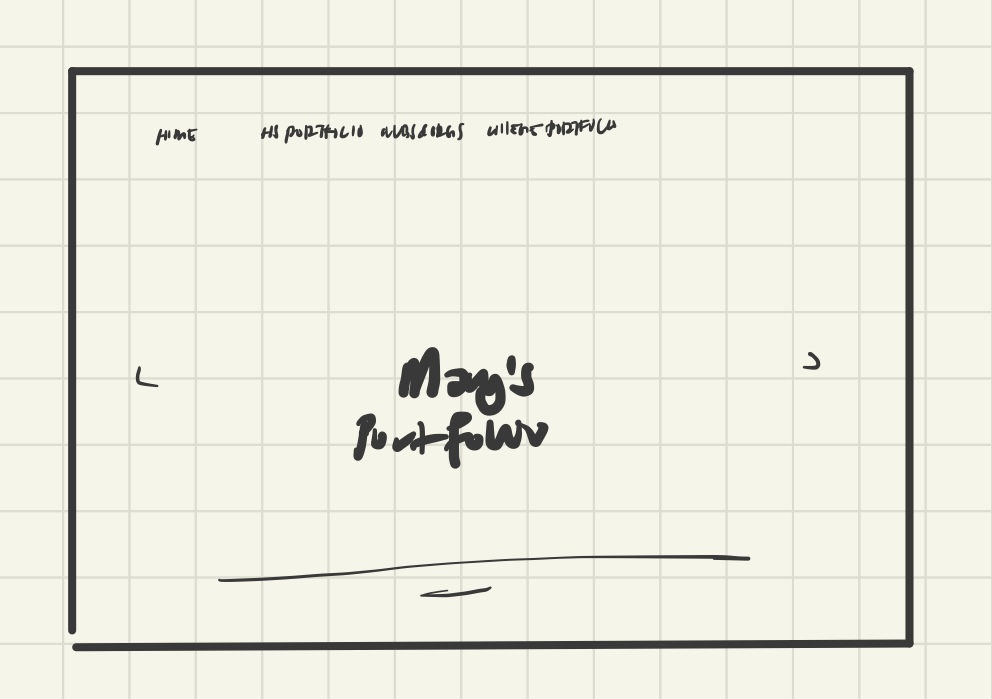
The home pages uses a few of my artworks as the background banner. There is a carousel which allows the users to click through a few different of my artworks. I think it is a very impactful home page and very simple but straight to the point. The navigation bar is on the top left and title is centered. Since the light turquoise color scheme is somewhat pastel, it will also be pleasing to the audience's eyes without being too distracting to the actual content of the pages. I think the turquoise could nicely complement and contrast the pink of the background image in the home page without being too distracting.

Page 2: HS Portfolio
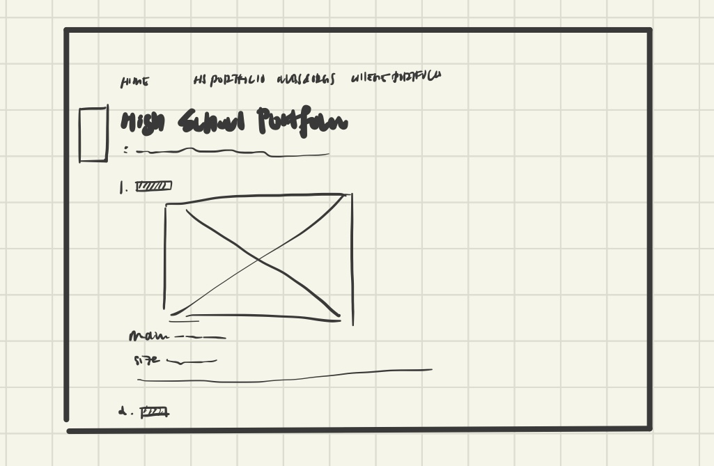
Page 3: Clubs & Orgs
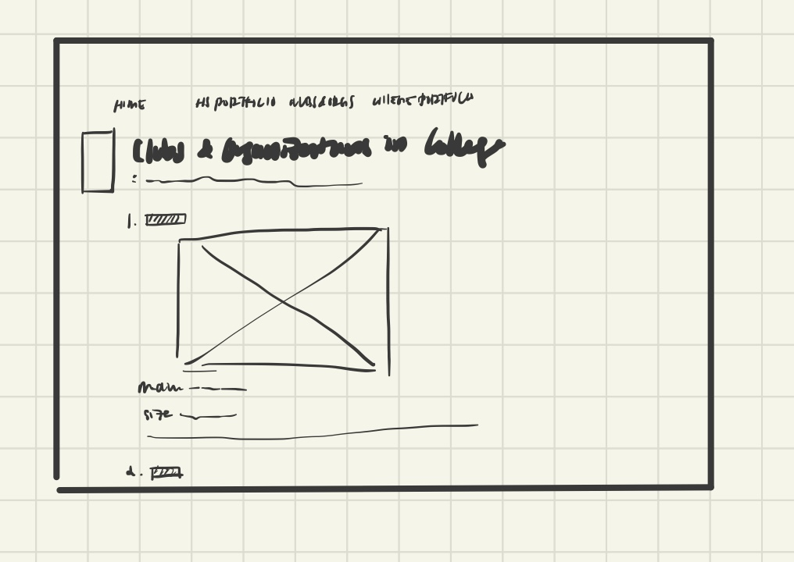
Page 4: College Portfolio
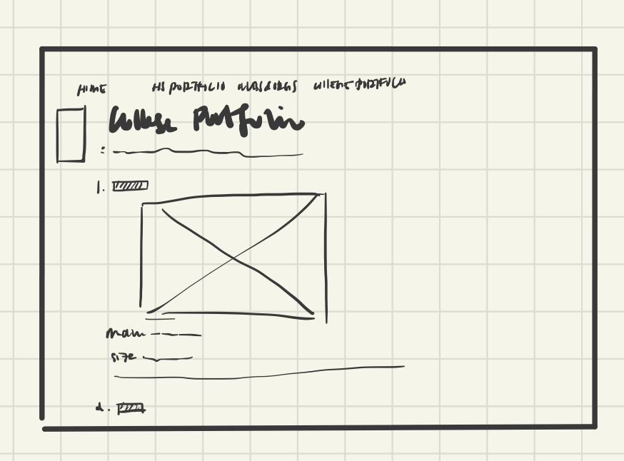
The design style for all three of my content related pages are uniform with a monochromatic turquoise color scheme. I think that light turqouise is a very neutral color that is quite unique and pleasing to the eye. I think that a single color scheme is better to express my professionality and aesthetic taste to the audience. Therefore, they will be able to see what type of colors and harmonies I enjoy in my artwork. The names of the pieces are highlighted for emphasis. The size and style of the text varies throughout the page which correponds to the importance of the content.

## Milestone 1 Feedback Revisions (Milestone 2)
> Explain what you revised in response to the Milestone 1 feedback

There wasn't anything needed to be fixed from feedback

## Refined Design (Milestone 2)

### Refined Design: Persona (Milestone 2)
> Use the goals you identified above from your prior user research to develop a persona of your site's audience.
> Your persona must have a name and a face. The face can be a photo of a face or a drawing, etc.
> You may type out the persona below with bullet points or include an image of the persona. Just make sure it's easy to read the persona when previewing markdown.

Persona's Name: Elizabeth

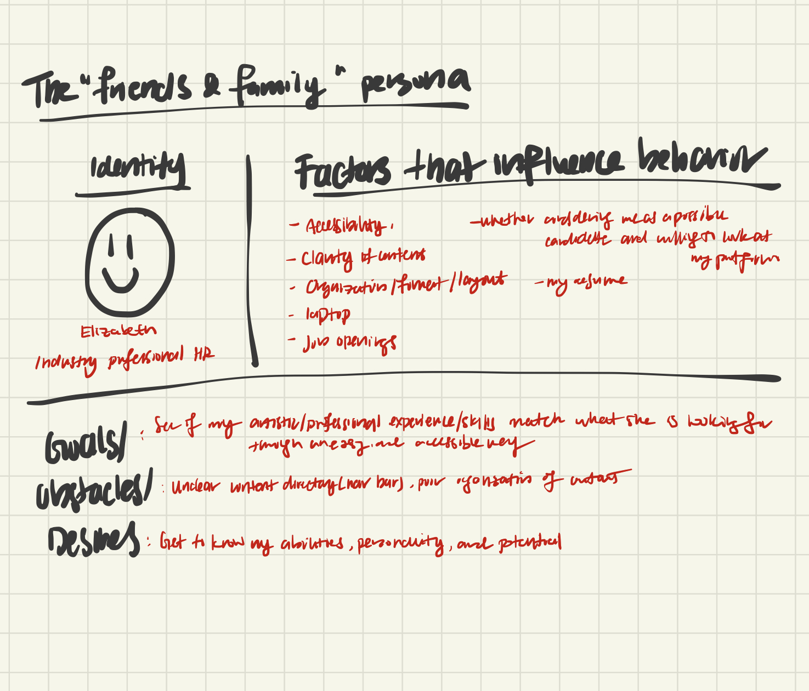

### Refined Design: Mobile or Desktop (Milestone 2)
> Will your refined design be functional on mobile, tablet, or desktop devices?

Desktop

### Refined Design: Form Brainstorm (Milestone 2)
> Brainstorm ideas for collecting data from your persona on your website.
> The form must support the persona's goals when using the website.
> For each form idea, explain how the form supports the goals of the persona.
> **Refer to the persona by name.**

1. The form could be a subscription form for new updates on my artwork. Often times, if I am a storng candidate at the moment or strong potential candidate in the future, professionals might appreciate seeing more of my work in the future. Elizabeth could subscribe to my website and if there is new content, she will be alerted and can check up on my works in her free time if she wants to. It also alerts me of her interest in my works.
2. The form could be an inquiry form regarding follow questions about my artworks. If Elizabeth has any questions about my artwork or if she wants clarification about my designs, filling the form on my website would be the easiest way. In addition, if she is looking for potential candidates for either job openings or collaborations, filling this form will also notify me and I could reach out to her.
3. The form could be a feedback form where Elizabeth could submit feedback or advice regarding my works. Sometimes, it would be nice to just have feedback on my website whether it be the organization or the content. Having advice from a professional would be amazing.

### Refined Design: Content (Milestone 2)
> List **all** the content you plan to include your website for your **persona**.
> You should list all types of content you planned to include (i.e. text, photos, images, etc.)
> List the content here. Label the content as "(new)" if it's new to the existing site.

- Many pictures of my artworks
- Descriptions of each artwork
- Title and subtitles
- Navigation bar
- Potential shapes for aesthetic purposes

### Refined Design: Content Justification (Milestone 2)
> Explain why this content supports the goals of your persona.
> **Refer to the persona by name.**

I think that in the broader setting of a technological focused world, interactive design and human interaction really attracts the eye of the audience. I believe that those who are interested in design are also more or less intrigued in how technology can be combined with art to create such innovative designs.

### Refined Design: Content Organization (Milestone 2)
> Organize the content for the audience and identify possible pages for the content using **multiple iterations** of card sorting.
> Include photographic evidence of each iteration of card sorting **and** a explanation of your thought process for each iteration.
> **Please physically sort cards;** please don't try and do this digitally.
> **Refer to the persona by name.**

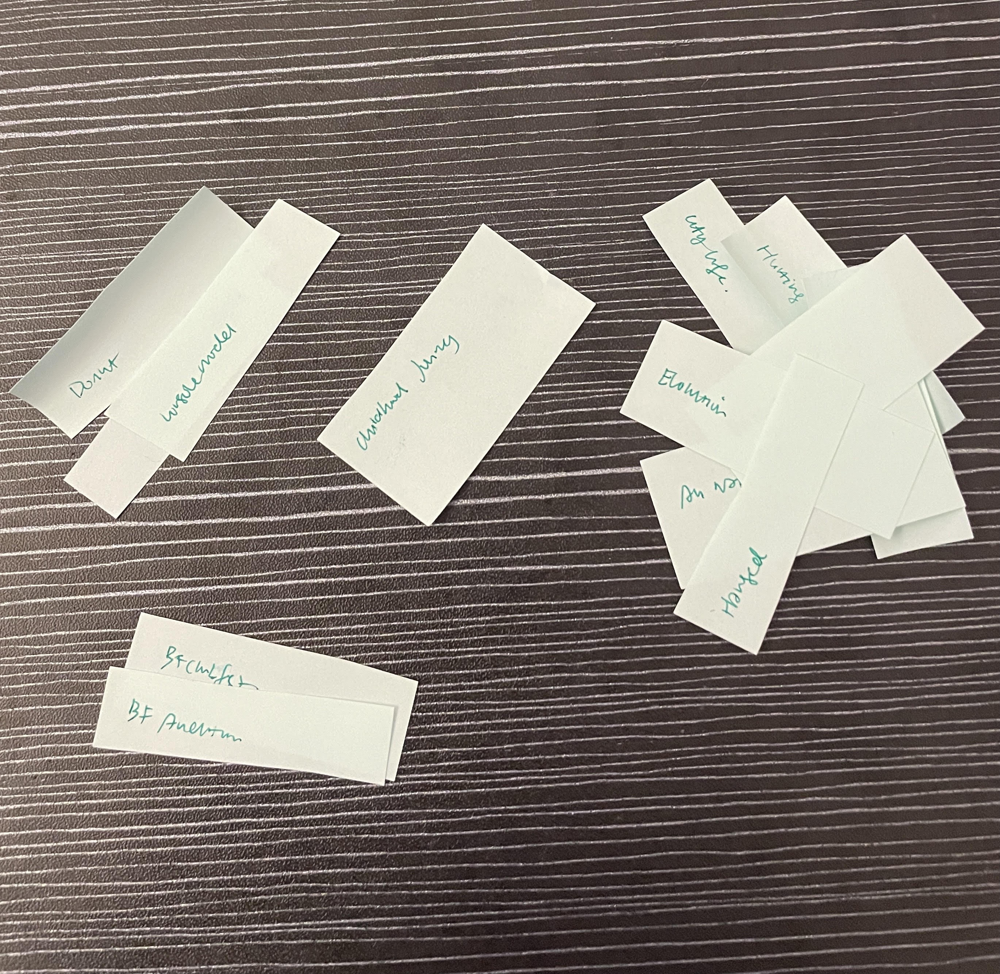
The first iteration has four categories: high school works, Breakfree works, MDC works, and DEA major works, contact me,
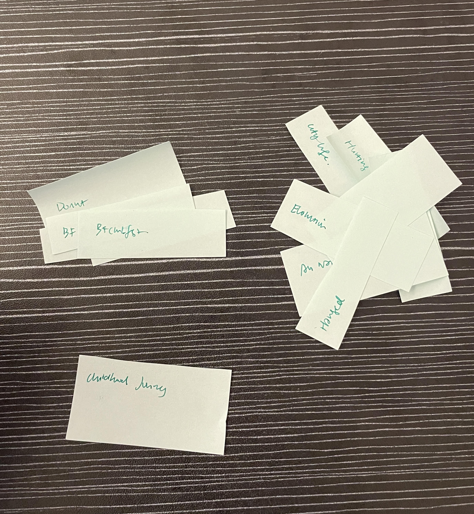
The second iteration has three categories: high school works, clubs and orgs works, and DEA major works contact.

I used my second iteration of card sorting because I think the broader categories make it clearer for those who do not what individual organizations such as Breakfree and Medium Design Collective are to understand which Elizabeth most likely doesn't. I think my final organization makes the most sense because it clearly seperates my different works into different periods of my life as well as different categories.

### Refined Design: Navigation (Milestone 2)
> Please list the pages you will include in your website's navigation.

- page 1: Home
- page 2: High School Portfolio
- page 3: Design of Clubs and Organizations in College
- page 4: College Portfolio
- page 5: Contact

> Explain why the names of these pages make sense for your persona.

The name for the pages clearly state which types of artworks I created falls in and easy to navigate. The names of the pages are also short but descriptive enough for Elizabeth to be able to tell what could be in each page without needing to press into it.

### Refined Design: Design (Milestone 2)
> Refine the design of your site to address the goals of your persona.
> Include iterations of **sketches** for each page of the refined design.
> Provide a brief explanation _underneath_ each sketch.
> Document your _entire_ design process. **Show your preliminary sketches and your final sketches.** **We want to see iteration!**
> **Refer to your persona by name in each explanation.**

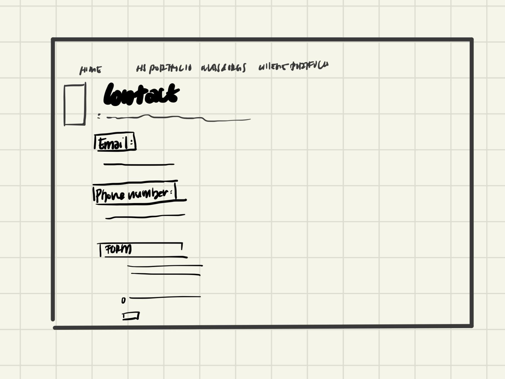
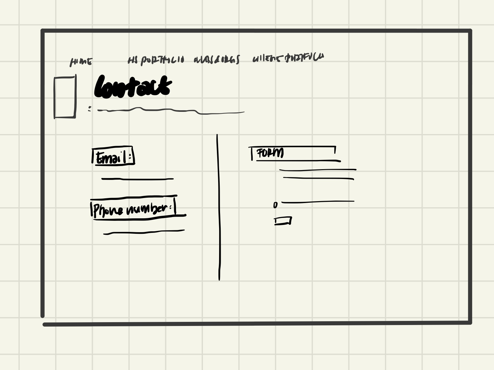
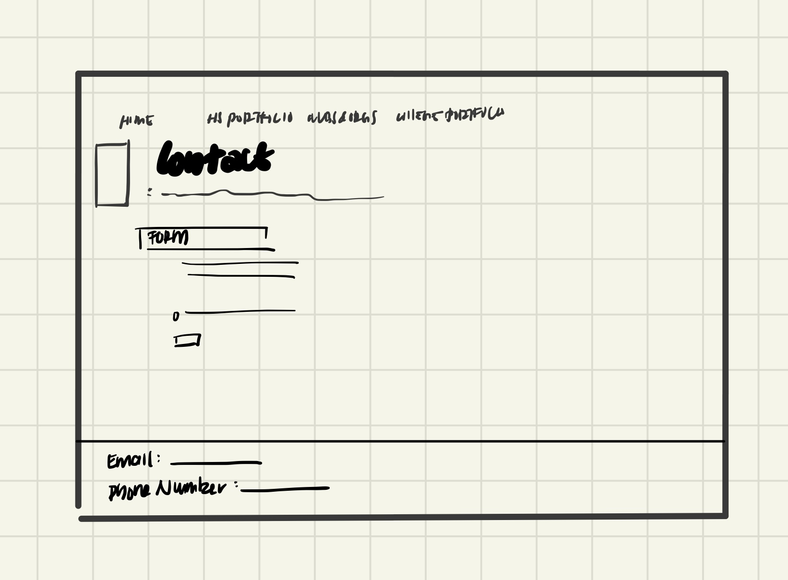
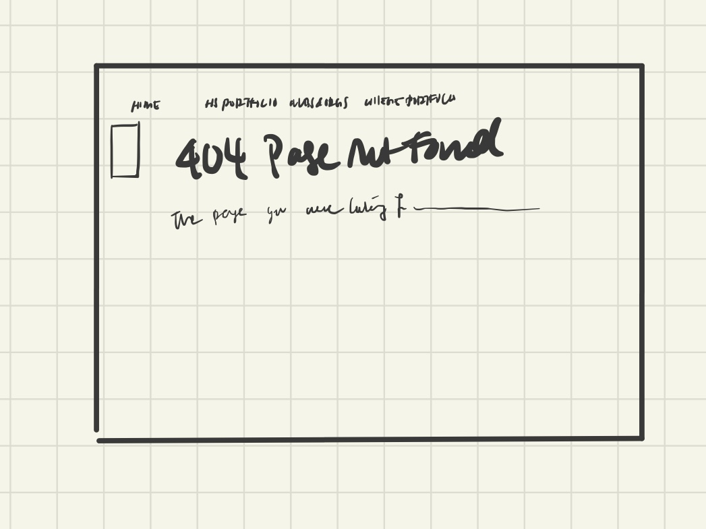
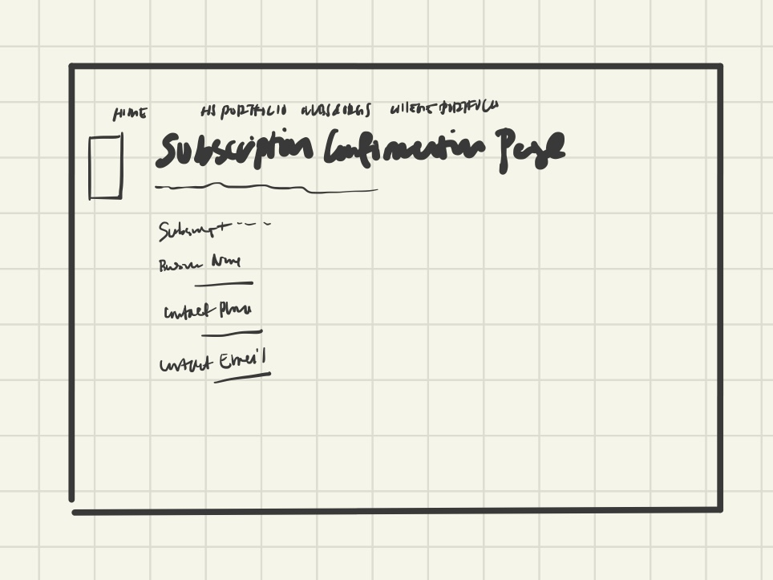
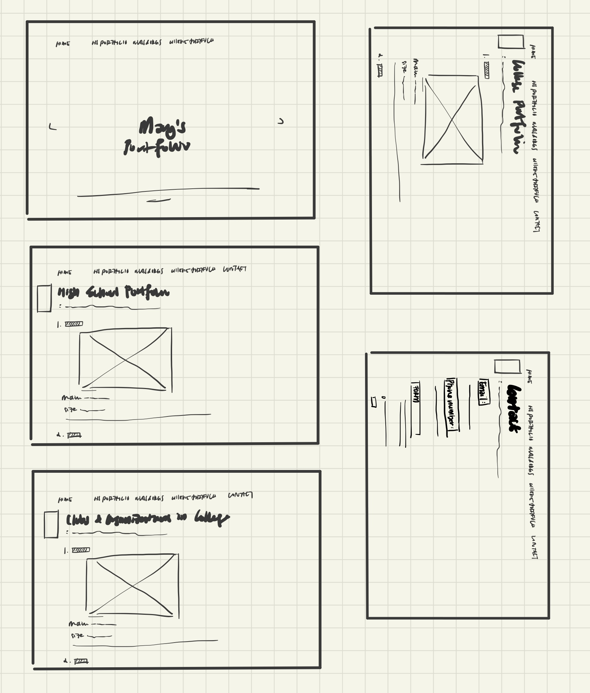

I think that my original website sketches and layout make sense for ELizabeth. I added a contact page so that Elizabeth can know how to reach out to me if she stumbles upon the page or if she has any freedback/questions for me. I made several iterations of the contact page but I decided to stick with the first iteration as it is most visually straight to the point and clear for Elizabeth.

### Partial Plan (Milestone 2)
> Using your refined sketches, plan your site's partials.
> You may describe each partial or sketch it. It's up to you!
> Explain how you will customize at least 1 partial.

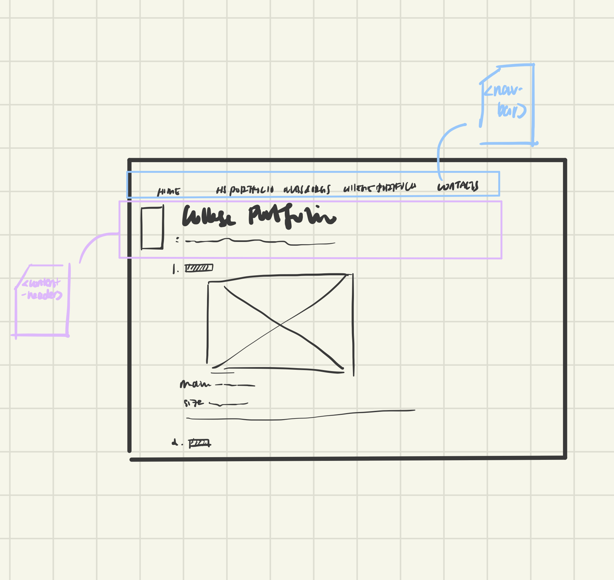
There will be two partials: one for header content and one for navigation bar. I seperated these two because the header content does not apply to every single of my pages whereas navigation bar does so it would not make sense to put those two together as a partial. I have customized it by adding variables that allow the changing of the title on corresponding pages.

## Milestone 2 Feedback Revisions (Milestone 3)
> Explain what you revised in response to the Milestone 2 feedback

I added the sketch pages for confirmation and 404 that I forgot about last time.

## Form Design and Planning (Milestone 3)

### Refined Form Design (Milestone 3)
> Refine the design of your site's form to address the goals of your persona.
> Include iterations of **sketches** of the form and its confirmation message.
> Provide a brief explanation _underneath_ each sketch.
> **Refer to the persona by name.**

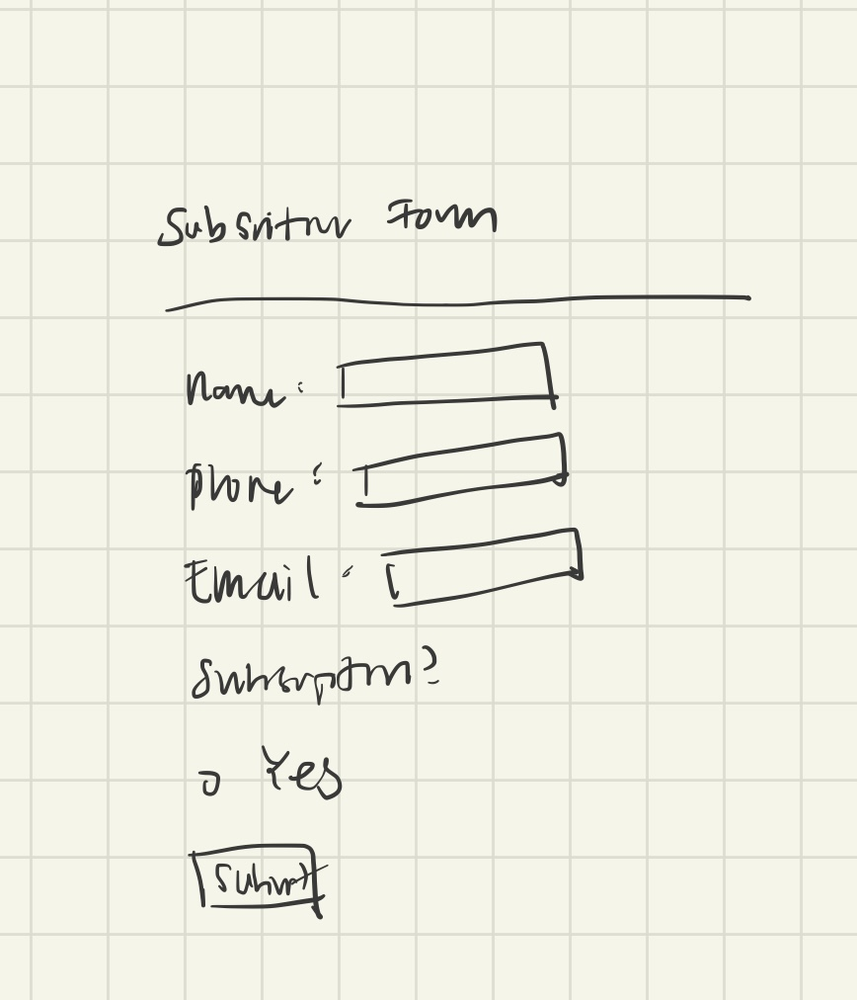
The first form is a simple subscription form which I went with in the end. Elizabeth will be able to subscribe to more content in the future if she is interested in my skills and want to see more updates in the future.

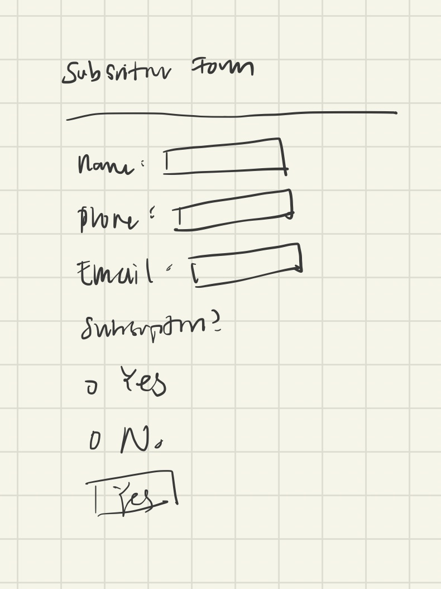
The second form is also a simple subscription form but I was debating whether or not to make it a Yes or No option to the subscription form but then I realized it made no sense to put a No option if she is not interested. If Elizabeth is not interested she would not fill out the form.

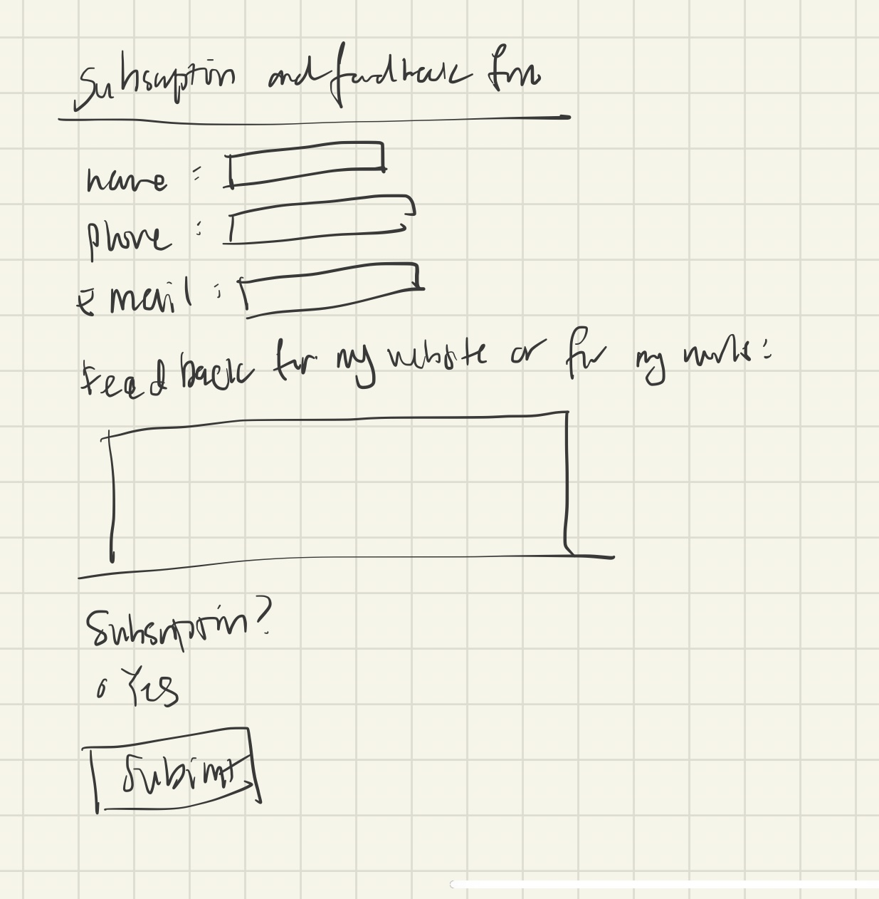
I thought about having a subscription and feedback form in one where Elizabeth can also give me feedback on my work. In the end, I felt like that was a bit unneccesary and that it is better to just go with a subscription form or else she might feel a bit overwhelmed.

### Form Planning (Milestone 3)
> Will your form use a GET or POST request.
> Justify your decision as to why the request type is appropriate for the form.

POST data doesn't appear in the URL whereas GET requests incudes all required data. As a result, GET is also less secure because data sent is part of the URL.

## Milestone 3 Feedback Revisions (Final Submission)
> Explain what you revised in response to the Milestone 3 feedback

Play with the form aligments

## Complete & Polished Website (Final Submission)

### Routing (Final Submission)
> Plan your HTTP routing.
> List each route and the PHP file for each route.

| Route       | PHP File                            |
| ----------- | ----------------------------------- |
| /           | pages/home.php (or pages/index.php) |
| /high-school| pages/high-school-portfolio.php     |
  -portfolio  |                                     |
| /club-design| pages/club-design.php               |
| /contact    | pages/contact.php                   |
| /college-   | pages/college-work.php              |
  work        |                                     |
| /contact/   | pages/subscription-confirmation.php |
  confirmation|

> Explain why these routes (URLs) are usable for your persona.

They are usable for Elizabeth because they are clear and straight to the point. She can easily know what the page is about just looking at the URL. They also correpond nicely with the page title as well.

### Refined Missing Resource Page (Milestone 3)
> Refine the design of your site's missing resource 404 page for your persona.
> Include iterations of **sketches** of the page.
> Provide a brief explanation _underneath_ each sketch.
> **Refer to the persona by name.**

TODO: sketches + explanation

### Accessibility Audit (Final Submission)
> Tell us what issues you discovered during your accessibility audit.
> What do you do to improve the accessibility of your site?

There are some suspicious alternative text for images and an empty text for the link of the citation. I changed the alt text of the ones that are reptitive or missing and then changed the way I cited to fix the empty text error.

### Final Design + Audience Goals (Final Submission)
> Tell us how your final site addresses the gaols of the audience.
> Be specific. Tell us how you tailored your design, content, etc. to make your website usable for your persona.
> **Refer to the persona by name.**

Since one of my goals is to portray my professionality and skills through the website, it is important that my design choices can showcase my design skills as well as express my aesthetic taste to Elizabeth. My emphasis on color theme cohesion and minimalistic is well displayed in the website's layout. I think that light turqouise is a very neutral color that is quite unique and pleasing to the eye. I think that Elizabeth can easily sort thorugh my works through the name of page titles in nav bar as well as the url names.

### Self-Reflection (Final Submission)
> Take some time here to reflect on how much you've learned since you started this class. It's often easy to ignore our own progress. Take a moment and think about your accomplishments in this class. Hopefully you'll recognize that you've accomplished a lot and that you should be very proud of those accomplishments!

I think I have learned alot about php website design as well as accesibility and dynamic websites. I think that the material really correponded well with the content learned in class and practiced in lab. I feel pretty confident about what I have learned and I think everything has gone pretty smoothly.

## Grading (Final Submission)

### Grading: Mobile or Desktop (Final Submission)
> When we grade your final site, should we grade this with a mobile screen size or a desktop screen size?

Desktop

### Grading: Partials (Final Submission)
> Clearly list each partial file and where you used it.

- content-header.php (every page except for the home page index.php)
- nav-bar.php (every page)

> Which partials have customization? Explain how the customization looks in the browser.

Both partials have customization as for the content-header.php the title and subtitle of each page is different and for nav-bar.php the active page is different.
- content-header.php is the design of header at the top page of every page except for the home page
- nav-bar.php is the design of the navigation bar that is present at the top of every page

### Collaborators
> List any persons you collaborated with on this project.

n/a

### Reference Resources
> Please cite any external resources you referenced in the creation of your project.
> (i.e. W3Schools, StackOverflow, Mozilla, etc.)

canvas material
